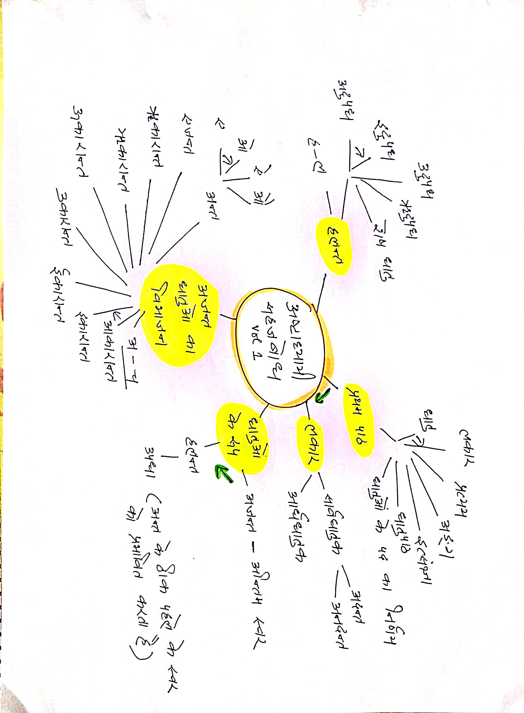
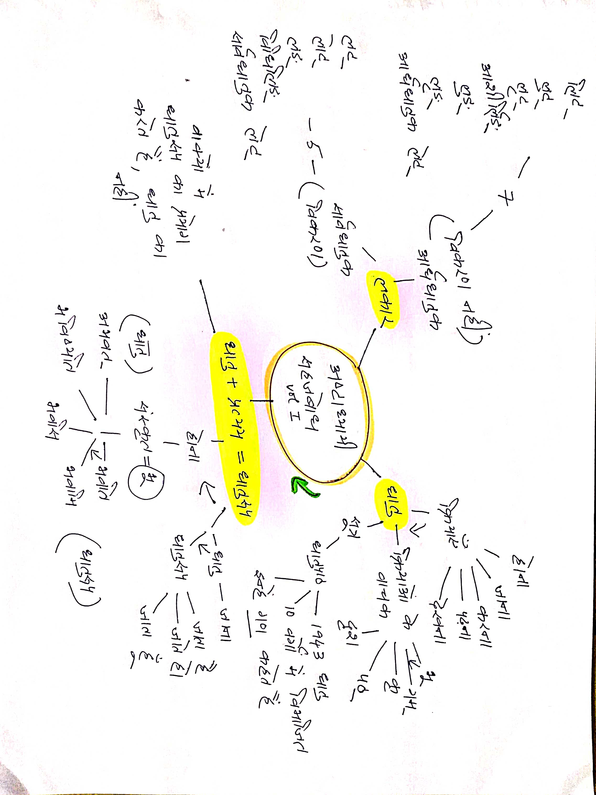
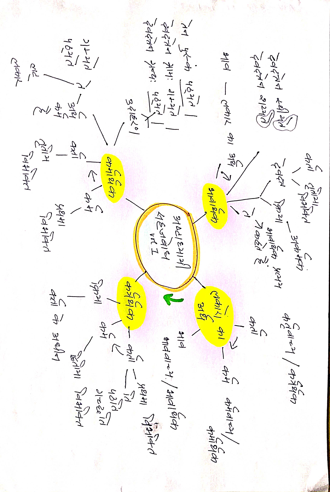
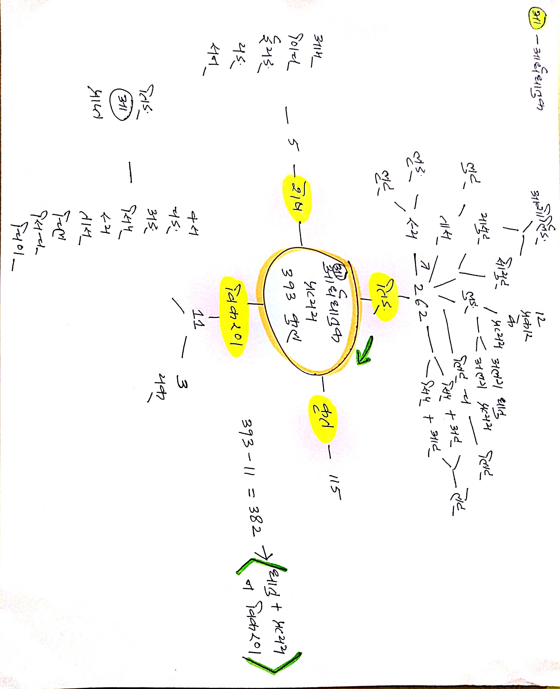

# Ashtadhyayi Sahajbodh Mind Maps

- [ ] [Ashtadhyayi Sahajbodh Sarvdhatuk Khand](https://archive.org/details/wg849)
- Ashtadhyayi Sanskrit Grammar given by [Maharishi Panini](https://en.m.wikipedia.org/wiki/P%C4%81%E1%B9%87ini). 
- Grammar in Eight Books with Four Chapters each, each chapter containing 38-220 Sutras. 

