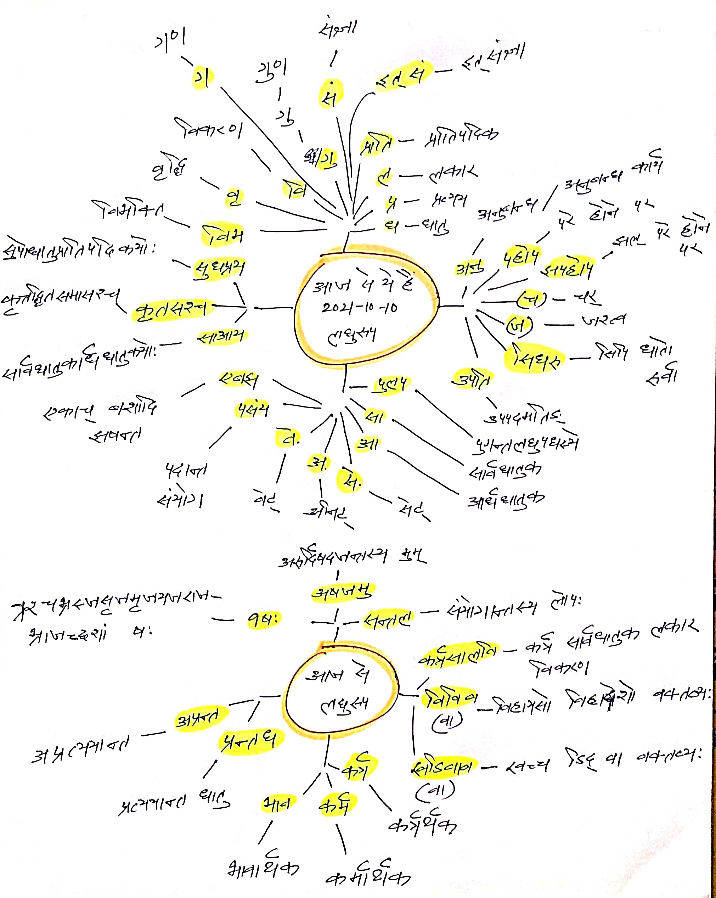
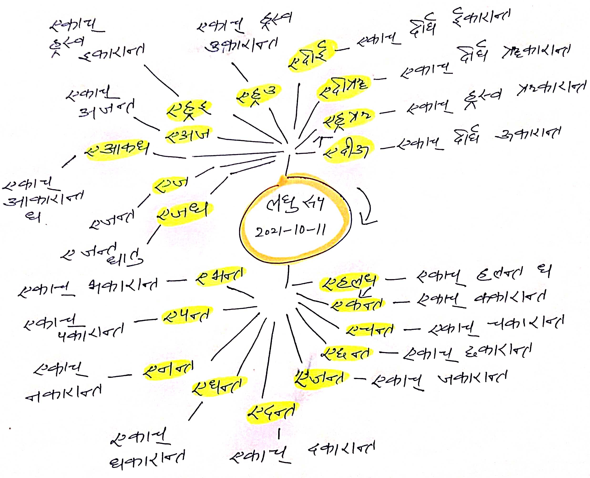
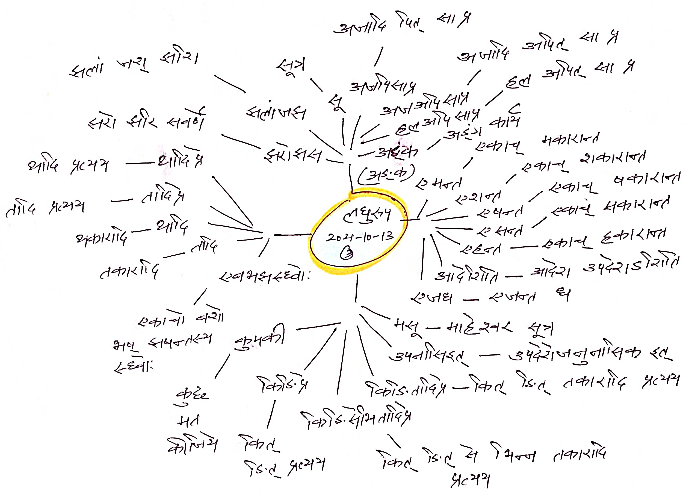
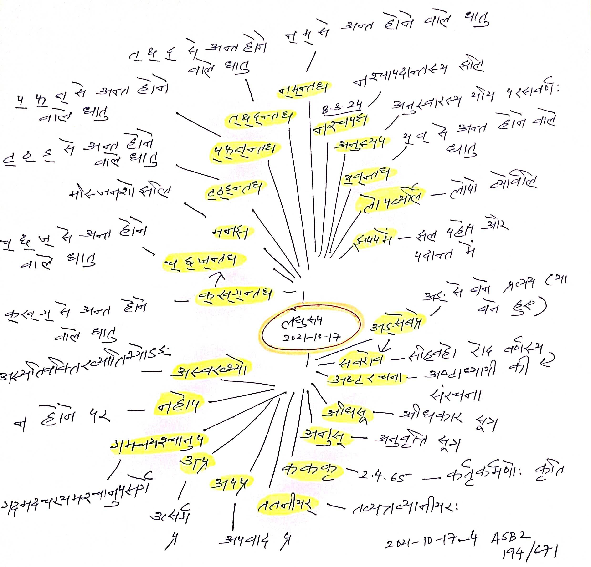

# अष्टाध्यायी सहजबोध लघुरूपाणि (Ashtadhyayi Sahajbodh Abbreviations) 

- सरलीकरण हेतु स्वपरिभाषित (Self defined for simplicity)

### २०२१-१०-०९

### २०२१-१०-१०

### २०२१-१०-११

### २०२१-१०-१३

### २०२१-१०-१७

## Conventions 

- Clockwise direction of Mind Maps from 2021-10-11. 
- Use of different abbreviations from 2021-10-10. 
