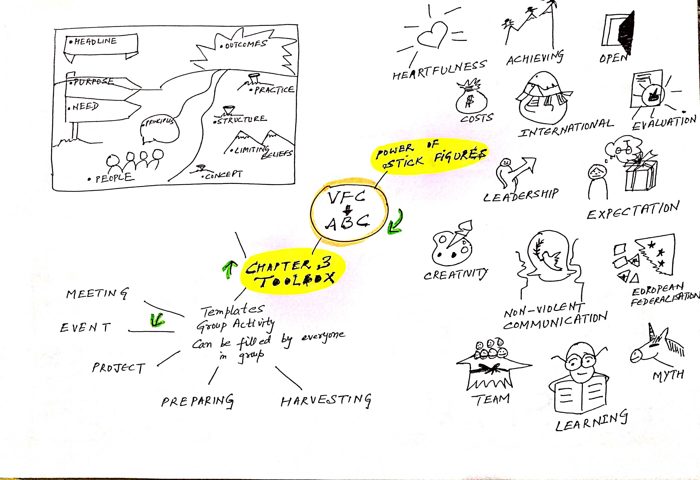
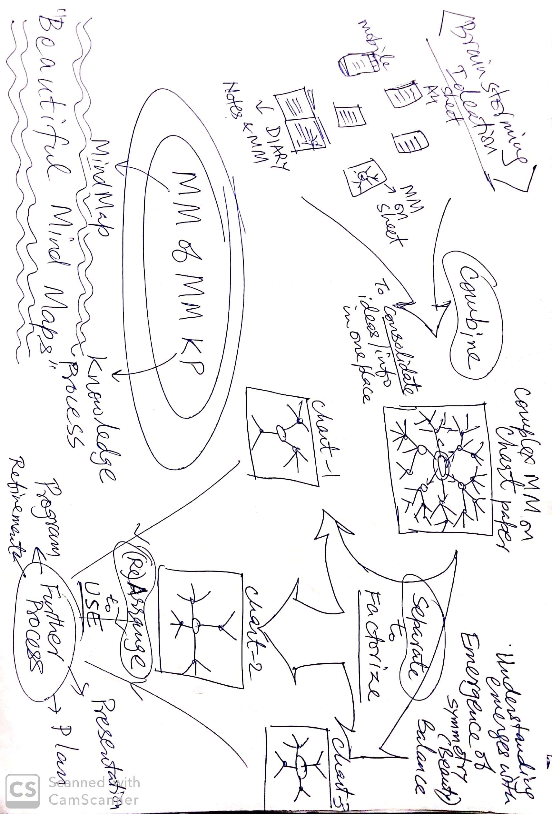
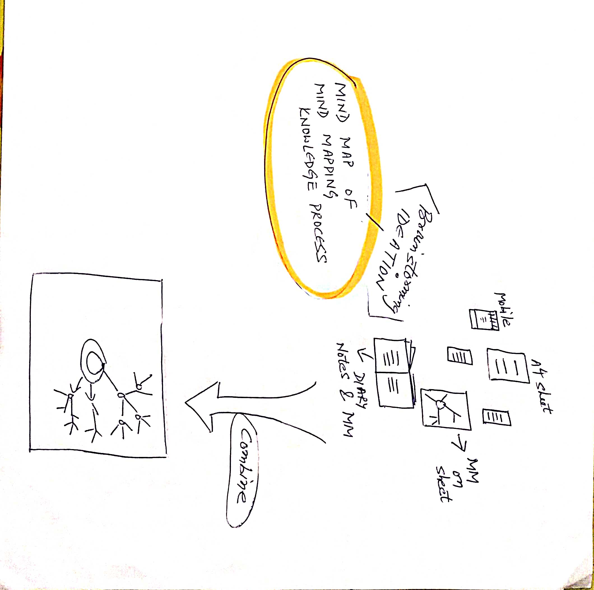
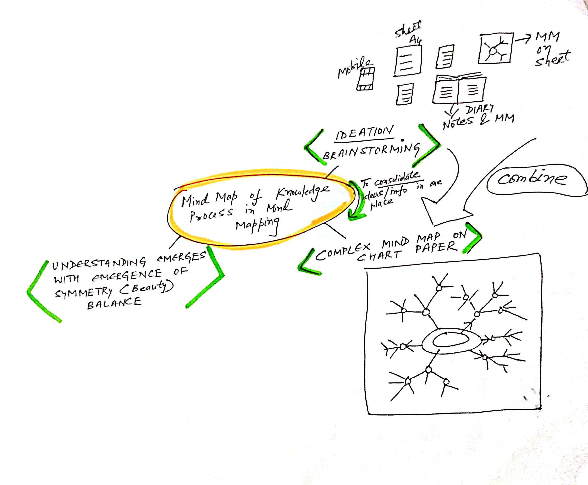
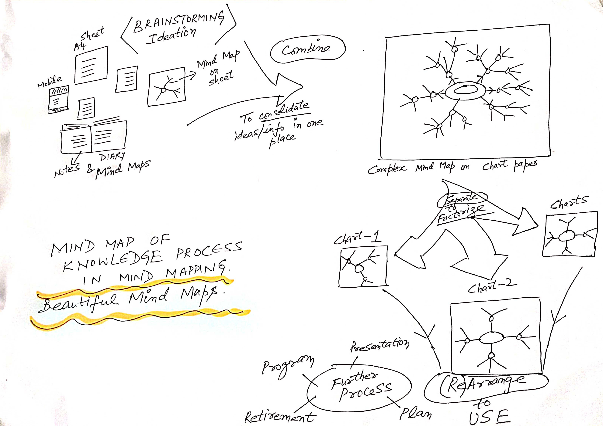

# Beautiful Mind Maps

<!--ts-->
* [<strong>Beautiful Mind Maps</strong>](#beautiful-mind-maps)
   * [Beauty <em>is</em> Understanding](#beauty-is-understanding)
   * [Visual Facilitation as presentation instance of Mind Mapping](#visual-facilitation-as-presentation-instance-of-mind-mapping)
   * [Better Understanding through Mind Mapping](#better-understanding-through-mind-mapping)
   * [Build UNDERSTANDING and INSIGHTS with Mind Mapping](#build-understanding-and-insights-with-mind-mapping)
   * [Artificial Intelligence Virtual Machine Framework International Project](#artificial-intelligence-virtual-machine-framework-international-project)
   * [Women Safety and Empowerment](#women-safety-and-empowerment)
   * [Sanskrit](#sanskrit)
       * [Ashtadhyayi](#ashtadhyayi)
       * [Kaalbodhini](#kaalbodhini)
       * [Class 6 Sanskrit Surabhi](#class-6-sanskrit-surabhi)
   * [BhagavadGita](#bhagavadgita)
   * [Mind Mapping for Individual Capacity Enhancement](#mind-mapping-for-individual-capacity-enhancement)
   * [Mind Mapping for Organizational Capacity Enhancement](#mind-mapping-for-organizational-capacity-enhancement)
   * [Why copying Mind Maps is a bad idea!](#why-copying-mind-maps-is-a-bad-idea!)
  * [Quick Notes when Visual Facilitation by way of Paper Mind Map not possible](#quick-notes-when-visual-facilitation-by-way-of-paper-mind-map-not-possible)
  * [WORKSHOPS](#workshops)
  
<!-- Added by: guest, at: Sat Aug 28 18:28:28 IST 2021 -->

<!--te-->

### _"Beauty reflects Understanding"_

#### Knowledge Process Management using Mind Maps

**Unified view** **of** **Aesthetics** **&** **Logic** **and of** **Art** **&** **Science**

## Beauty _is_ Understanding

- Beauty aids absorption. 
- Knowledge at a glance. 
- Simplicity, Symmetry and Balance as three outcomes and pillars of Mind Mapping. 

## Visual Facilitation as presentation instance of Mind Mapping

- To facilitate understanding. 
- Use of primary shapes, arrows, circle, triangle and square etc.
- Use of Stick diagrams for living shapes, such as trees, plants, humans, animals etc.

- [x] Mind Maps to illustrate power of Visual Facilitation in Mind Mapping. 
- [x] _Reference_: [_Visual Facilitation Cookbook_](https://www.salto-youth.net/downloads/toolbox_tool_download-file-1430/VF-cookbook-web.pdf)

## Better Understanding through Mind Mapping

As discovered in our successful flagship Financial Modelling and Product Development research project, **Understanding** is the work of brain not of tools. 

Mind Mapping in this aspect is a proven technique, in our experience that uses Knowledge Process as development stages to reach right conclusion. 

## Build UNDERSTANDING and INSIGHTS with Mind Mapping 

1. Succinct knowledge. Filtering sentences and writing keywords. Dates, days, key persons, places etc. 
    - Big to small. 
    - Also a book called Small is Beautiful. 
    - They say LESS IS MORE. Similarly SMALL IS BEAUTIFUL is true. 
    - Brevity is the soul of wit. 
2. Balanced tree shows clear understanding. 
    - Balance is the key. 
    - In all directions a tree should be balanced.
    - Balance is the key to success and happiness.
    - _Yoga is Equanimity._ Bhagavat Gita 2.48.
    - _Perfection in action is Yoga._ Bhagavat Gita 2.50.
    - Perfection = Yoga = Balance.
    - This holds true for data management online, offline and on devices (internal memory/hard disk). 
    - Not more than 3-4 sub branching. 3-4 key branching self innovated configuration number. 
3. Complex tree shows less clarity in understanding. 
    - Complex is undigested or not yet ready. 
    - Needs thinking and further processing. 
    - Information itself is not knowledge. Knowledge is filtered, understood and well presented information.
4. Building own understanding is not possible via devices (Automation). Understanding build-up is required at all instances by everyone. It is not specific to any domain. 
    - Understanding process is not mechanical. It cannot be automated. 
    - Mind Mapping can be automated but not thinking/understanding by human brain.
    - Mind Maps aid enhanced depth building as INSIGHTS in any domain.

## Artificial Intelligence Virtual Machine Framework International Project

Innovative use of Mind Mapping by us in the field of Lisp education and use are visible on web which have received wide international appreciation. 

PicoLisp is the marvel dialect of Lisp, the primary language for Artificial Intelligence.

Lisp is the most powerful computer language developed at Stanford University, USA by John McCarthy  who co-authored the document that coined the term Artificial Intelligence. [John McCarthy Wikipedia Reference](https://en.m.wikipedia.org/wiki/John_McCarthy_(computer_scientist))

Following are **links to my Mind Maps** of international project for artificial intelligence language virtual machine framework called **PicoLisp**.

1. [Beautiful and Lucid Mind Maps](https://picolisp.com/wiki/?beautiful-and-lucid-mindmaps)
2. [Pilcon Mind Maps](https://picolisp.com/wiki/?pilcon-mindmaps)
3. [Own PicoLisp Page for Mind Maps, Knowledge Process, Insights and more!](https://nehalsin.github.io/picolisp/)

I am making Mind Maps to help **ease** understanding of fundamental computer science concepts in a novel manner in this Germany based international project.

## Women Safety and Empowerment

### [SAMADHAN Mind Maps](samadhan.md)

### Complete Woman is Empowered Woman

  - Even this website sets an example that someone who is active in Artificial Intelligence, Sanskrit is as much into Cooking and other creative tasks that are considered domestic (in a bad taste, ugh! :(). 
  - Unified View of Art & Science, Aesthetics & Logic thus proved (by example case studies on this website). 
  
## Sanskrit

> Among the accomplishments of the grammarians can be reckoned a method for paraphrasing Sanskrit in a manner that is identical not only in essence but in form with current work in Artificial Intelligence. This article demonstrates that a natural language can serve as an artificial language also, and that much work in AI has been reinventing a wheel millenia old.  [Source](https://ojs.aaai.org//index.php/aimagazine/article/view/466)

### Ashtadhyayi

- Ashtadhyayi Sanskrit Grammar given by [Maharishi Panini](https://en.m.wikipedia.org/wiki/P%C4%81%E1%B9%87ini). 
- Grammar in Eight Books with Four Chapters each, each chapter containing 38-220 Sutras.
- Novel approach to the Paninian Sanskrit Grammar by [Mahamahopadhyaya Acharya Smt Pushpa Dikshit](http://www.pushpadikshit.com) presented as Ashtadhyayi Sahajbodh a three volume set of books.

#### [Ashtadhyayi Sahajbodh 1](https://nehalsin.github.io/ashtadhyayi-sahajbodh-1/)

#### [Ashtadhyayi Sahajbodh 2](https://nehalsin.github.io/ashtadhyayi-sahajbodh-2/)

#### [Ashtadhyayi Sahajbodh 3](https://nehalsin.github.io/ashtadhyayi-sahajbodh-3/)

### [Kaalbodhini](https://nehalsin.github.io/kaalbodhini/)

### [Class 6 Sanskrit Surabhi](c6s_surabhi.md)

## BhagavadGita

- [x] [Gita for Women page](https://github.com/nehalsin/gitaforwomen/wiki) with Podcast links. 

## Mind Mapping for Individual Capacity Enhancement

### How Mind Maps can reveal and show strengths, weaknesses and special trends of an individual?

1. To bring objectivity to an inherently subjective domain of Mind Mapping. No benchmarking possible because of inherent subjectivity.
2. Growth of mind can be measured individually, in terms of evolution of Mind Map quality over a period of time. 
3. Analysis will be subjective. 
    - It will be like deciding in an Art competition. 
    - How can Art be seen quantitatively? 
4. Graphology and other such analyses are some ways to analyse mind of an individual. Mind Map based analysis can be similar.
5. Two types of analyses - **Comparative for collective** and Evolution for **Single Individual**. 
    - Comparative is for large number of people. Example: One incident being reported by different persons, people will make maps differently. Centre, branches, leaves will contain different information revealing valuable insights about those who made the mind maps.
    - Single Individual: Evolution. Initial. Over a period of time. 
6. However a convention can be developed like Visual Facilitation Cookbook or similar handbooks for **uniformity, benchmarking and comparison**, such as capital letter for emphasis, bold and italics etc.. This will facilitate comparison. 

## Mind Mapping for Organizational Capacity Enhancement

### In depth view of using Mind Mapping for individual/organizational capacity enhancement.

1. Organization can be seen in two different levels, Individual and Collective. Individual capacity enhancement is covered above. 
2. Collective capacity enhancement by building and strengthening of team spirit. 
    - Mind Mapping can be used as a tool for collective understanding as **collective insights** emerge. 
    - **Emergence of Collective Understanding** goes in tandem with building of Team spirit. 
    - **Large Mind Map Chart** can be made by a team. This calls for synergy and coordination at various levels among team members.
3. **If a team can make a good mind map together, they can work well together.**

## Why copying Mind Maps is a bad idea! 

1. **Non transferability of experience.** Because copied mind maps are not beautiful.
2. **Necessity of experiment.** Because evolution of understanding, hence that of mind map is unpredictable.
3. **Beauty is resonance with self.** When one understands one sees beauty in it. Both beauty and understanding are subjective, they depend on the person. Understanding depends on mind, beauty lies in the eyes of beholder.
4. **Role of facilitator is only to initiate.** 

**Let us see why mind maps cannot be copied in the following example:** 

`Original`

`Copied - First Attempt`

`Copied - Knowledge Process in Mind Mapping Attempt 2`

`Copied - Knowledge Process in Mind Mapping Attempt 3`

`Knowledge Process in Mind Mapping Attempt 4, NO COPY, Own Creativity`

## Quick Notes when Visual Facilitation by way of Paper Mind Map not possible 

Let us take presentation instance of my hobby [**Cooking**](https://nehalsin.github.io/cooking/). The maintenance of file is simple, with date detailing and quick abbreviations to illustrate that a particular recipe is being prepared first time. 

This is also Mind Map in linear fashion on phone when paper visual facilitation is not possible for instant notes on hand held device. 

## WORKSHOPS

[**WORKSHOPS**](https://nehalsin.github.io/workshops/) for Students, Professionals and Organisations available. 
