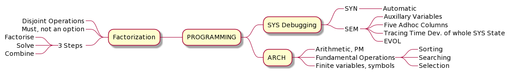

# R Data Table

- [R](https://www.r-project.org/about.html) is programming language and free software environment for Statistical Computing and Data Analysis used by data miners and staticians.
- [Data Table (data.table\)](https://cran.r-project.org/web/packages/data.table/vignettes/datatable-intro.html) is highly useful for Data Manipulation operations. 

**R Data Table Case Study Text**

Click to expand!

## Abbreviations (14)

ARCH - Architecture

DB - Database

Defn. - Definition

Dev. - Development

df - Data Frames 

dm - Decision Making

DS - Data Structure 

DT - Data Table 

EVOL - Evolution

PM - Portfolio Management

SEM - Semantics

SYN - Syntax 

SYS - System

VM - Virtual Machine

## Economics 

### Defn.

dm 

Finiteness of Resources

Maximization - Various Parameters

Finiteness of resources 

### SYS 

Chess game

Finite dm

EVOL - dm, Intervals, Finiteness of Resources, Monitor EVOL of SYS

## VM ARCH of PM 

Complete Problem

General Model

### Financial Modelling 

Complete for any business

Isomorphic (organization, employees, start-termination) 

### Looks to be a small problem 

Simplest Modelling

Very Enlightening

## Programming

### SYS Debugging

SYN - Automatic

SEM - Auxillary Variables, 5 Adhoc Columns, Tracing Time Dev. of whole SYS State, EVOL

### ARCH 

Arithmetic, PM

Fundamental Operations

Sorting, Searching

Finite variables, symbols (varying number of parameters), selection (finite)

### Factorization

Disjoint Operations

Must, not an option

3 Steps (Factorise, Solve, Combine) 

## Sticking to DS 

### DS

DT

Shortest Program 

Any DB problem can be approached

Code eminently readable

Style guide

Variables, blocks 

### df

210 df

4000 operations/commands

Each file 20 operations

Choose between SEM right strategies

### dm

Not random buy sell

Extra fields, extra dm

4000 automatic, not humanly possible

### Discipline

Sticking to DS, DT, List of lists, Lisp programming

If given to solve to else may take any amount of time

Like Irodov problems

Size, Existence, Auxillary Variables (order, reorder columns) 

### Proper EVOL

No unnecessary combining together

Example: A, B, C. D depends on A, B, C. Cannot have E depending on D. Code to be factored. 

Cases, Combinations, Scope Restrictions (cause beautiful factorisation of code at conceptual level) 

Naturally, in Bhatti Kavya, intended aim was known with set of rules. Ashtadhyayi was known. Explained through specific case of Ramayana. 

Not academic project

Real life project to be deployed, must be right

Strategy building and combining

## Stepwise Understanding of Knowledge Process through R Data Table

- Mind Maps in three iterations on A4 paper. 
- Beauty is Understanding
    - Balance
    - Symmetry
    - Simplicity
- Factorization
    - About same number of iterations on soft copy mind maps
        - (Re)Balance
        - (Re)Arrange
        - (Re)Order
        - Shorten
        - Simplify

## A4 Mind Maps

Let us see Knowledge Process in action in following iterations. 

### Iteration 1

All information on A4 Sheets

### Iteration 2

Planning, Arranging, Segregating

### Iteration 3 

One Mind Map and rest information being processed by mind for better depiction with balance. 

## Soft Copy Mind Maps 

### Complex Initially

### Post Factorization

#### Abbreviations

#### Major Categories

#### Economics and Virtual Machine Architecture of Portfolio Management

#### Programming

#### Sticking to Data Structure

Before Factorization

After Factorization

